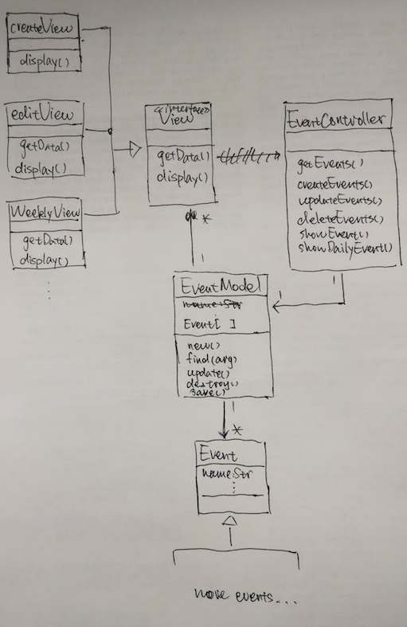
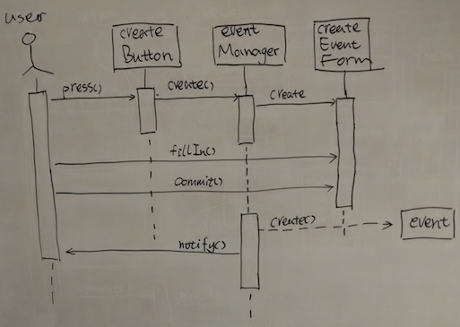
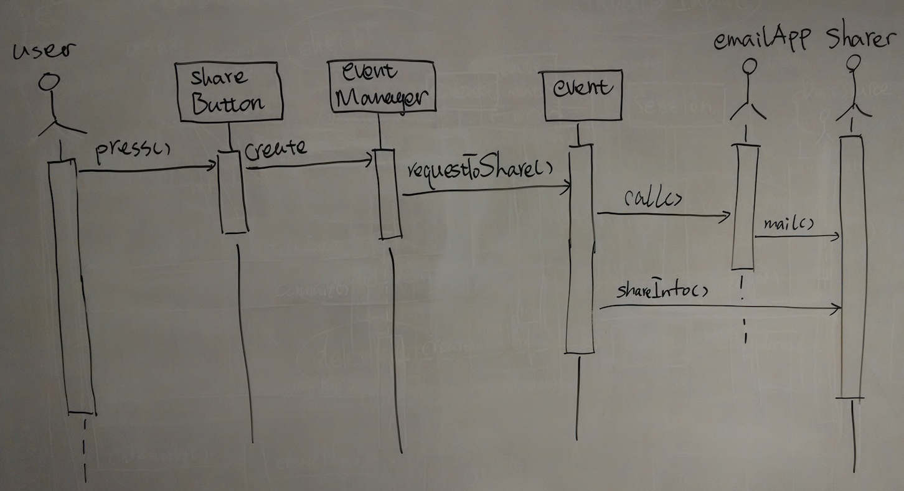

CalendarAppDesign
=================

A design of calendar app on mobile phone.

## Requirements
1. The user should be able to create, manage and check the events.
2. The user should be notified by upcoming event.

## Actors
1. User: the person who uses the app.

## Scenarios
#### _newMeetingAnnouncedByBoss_
#### Participating actors: 

mike:User

#### Flow of events:

- today when mike is at work, his boss, jack, announces a new meeting tomorrow 10 a.m.
- to help himself remember the event, mike creates a new event with his calendar app. He inputs the date, time, location, when to notify and the name of the event, and then saves it.
- the next day, at 9 a.m., mike's phone buzzes. When he pick up the phone, mike realizes the meeting is within one hour, so he starts preparing relevant materials.

***

#### _InterviewRescheduled_
#### Participating actors: 

mike:User

#### Flow of events:

- mike, who tries to land a job, receives a phone call from company x, saying that due to time conflicts, his interview with the company has been scheduled to another time, but the location is the same.
- mike thanks for the update, and then decides to modify the event of this interview on his calendar app.
- mike opens the app, selects the event, and modifies only the time and data, keeps other information unchanged, and then saves the event. The event has been updated.

***

## Use cases

#### _createEvent_
#### Participating actors

initialized by User

#### Flow of events

- _User_ requests to create a new event.
	- The app presents _User_ with a form. 
- _User_ specifies a name, time and date, location, whether enable notification, and if do when to notify, for the event. Then _User_ saves the event.
	- The app notifies _User_ the event has been created.
	- If _User_ enables the notification function, when the time has come to the time _User_ setup as the notification time, the app notifies _User_ the event is coming up.

#### Entry condition

- _User_ must know necessary information of the event.

#### Exit condition

- A new event exists.
- _User_ receives notification that the event has been created.
- The event is available to be browsed.

***

#### _editEvent_
#### Participating actors
initialized by User
#### Flow of events

- _User_ requests to edit an existing event.
	- The app presents _User_ with a form showing the information of the event. 
- _User_ changes fields accordingly. Then _User_ saves the event.
	- The app notifies _User_ the event has been updated.
	- If _User_ enables the notification function, when the time has come to the time _User_ setup as the notification time, the app notifies _User_ the event is coming up.

#### Entry condition

- The event must exist.
- _User_ must know necessary information of the event.

#### Exit condition

- The information of the event has been updated.
- _User_ receives notification.

***

#### _checkEvent_
#### Participating actors
initialized by User
#### Flow of events
- _User_ requests to check his/her events.
	- The app presents events as bullet lists for each day of the current month.
- _User_ selects one event.
	- The app presents the information of the event including xxxx.

#### Entry condition

- The event must exist.

#### Exit condition

- _User_ knows his/her events now.

***

## Class diagram

- Follow _MVC_ architecture style, because
	- There exist multiple views (Year, Month, Week, Day) for one single type of object (Calendar event)
	- The interaction of the object is fixed (create, edit, delete)
- _View_ is an abstract interface, which requires subclass to do the implementation

## Sequence diagram (TODO:fix)

## Questions
1. where should I put the function of notifying upcoming events?
2. should the _shareEvent_ include EmailApp, or provide its own sharing function?
