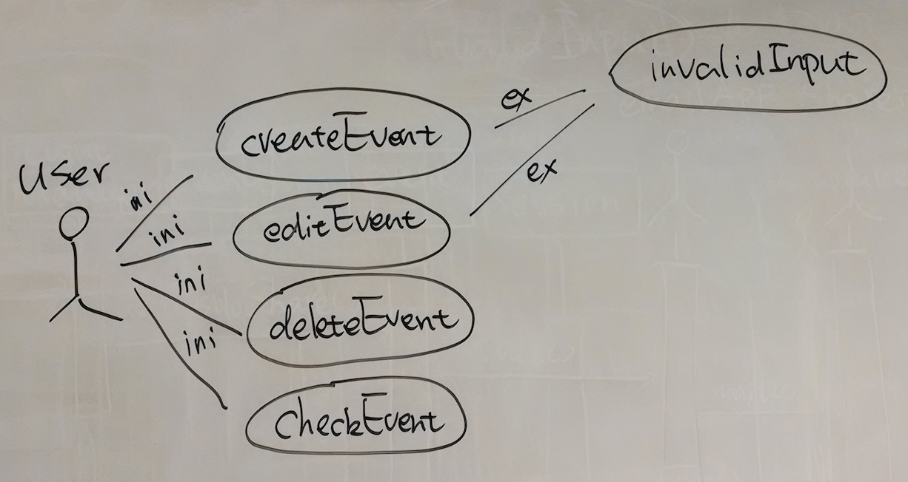

CalendarAppDesign
=================

A design of calendar app on mobile phone.

## Requirements
1. The user should be able to create, manage and check the events.
2. The user should be notified by upcoming event.

## Actors
1. User: the person who uses the app.
2. Sharer: the person who the user shares schedules to.
3. EmailApp: an app on the same phone which could send email.

## Scenarios
#### Name: newMeetingAnnouncedByBoss
----------------
#### Participating actors: 
mike:User, joe:Sharer, gmail:EmailApp
#### Flow of events:
- today when mike is at work, his boss, jack, announces a new meeting tomorrow 10 a.m.
- to help himself remember the event, mike creates a new event with his calendar app. He inputs the date, time, location, when to notify and the name of the event, and then saves it.
- joe, a colleague of mike, saw mike create the event. He then ask mike to share this event with him through email. mike opens his phone, selects share the event in the calendar app, which brings up his gmail app with a new email. The content of the new email is already filled with information of the event. The shared email includes everything but information about notification. mike then sends the email to joe.
- the next day, at 9 a.m., mike's phone buzzes. When he pick up the phone, mike realizes the meeting is within one hour, so he starts preparing relevant materials.

#### Name: InterviewRescheduled
----------------
#### Participating actors: 
mike:User
#### Flow of events:
- mike, who tries to land a job, receives a phone call from company x, saying that due to time conflicts, his interview with the company has been scheduled to another time, but the location is the same.
- mike thanks for the update, and then decides to modify the event of this interview on his calendar app.
- mike opens the app, selects the event, and modifies only the time and data, keeps other information unchanged, and then saves the event. The event has been updated.

## Use cases

